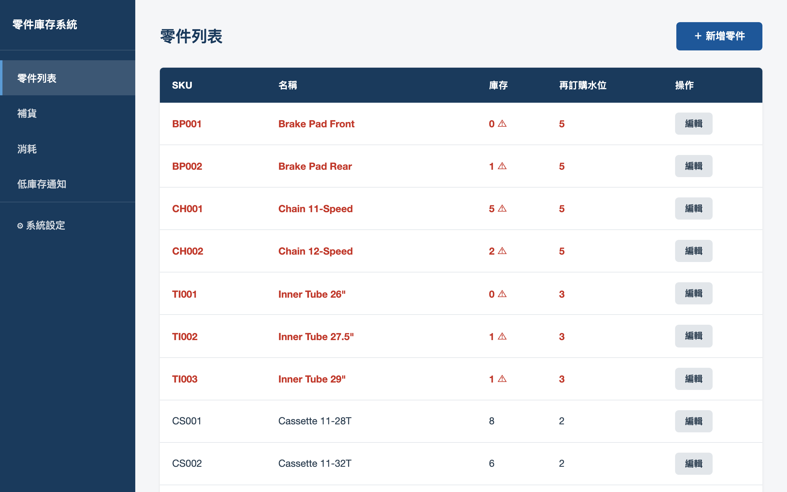
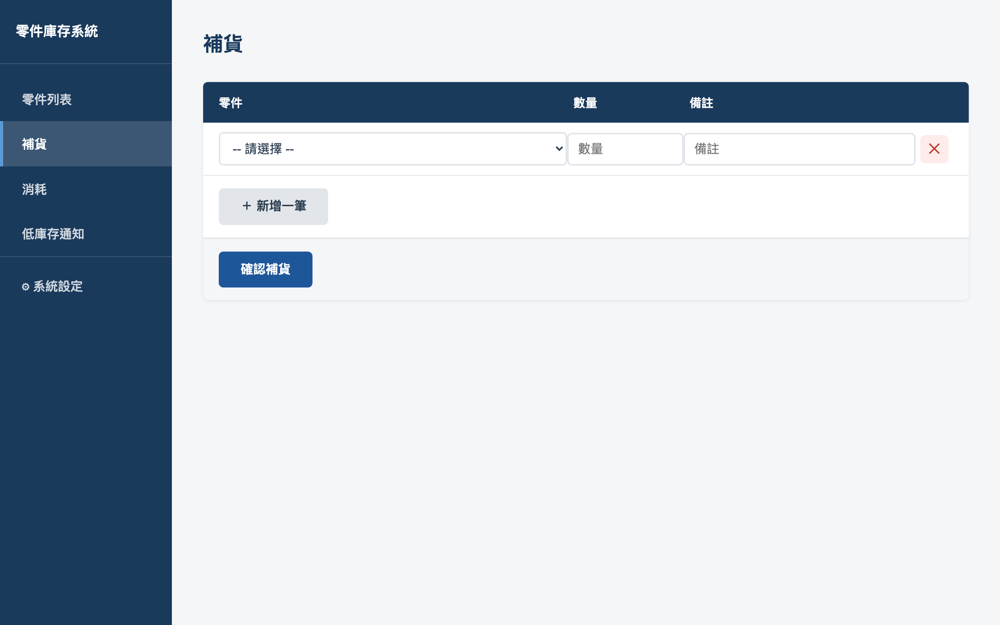
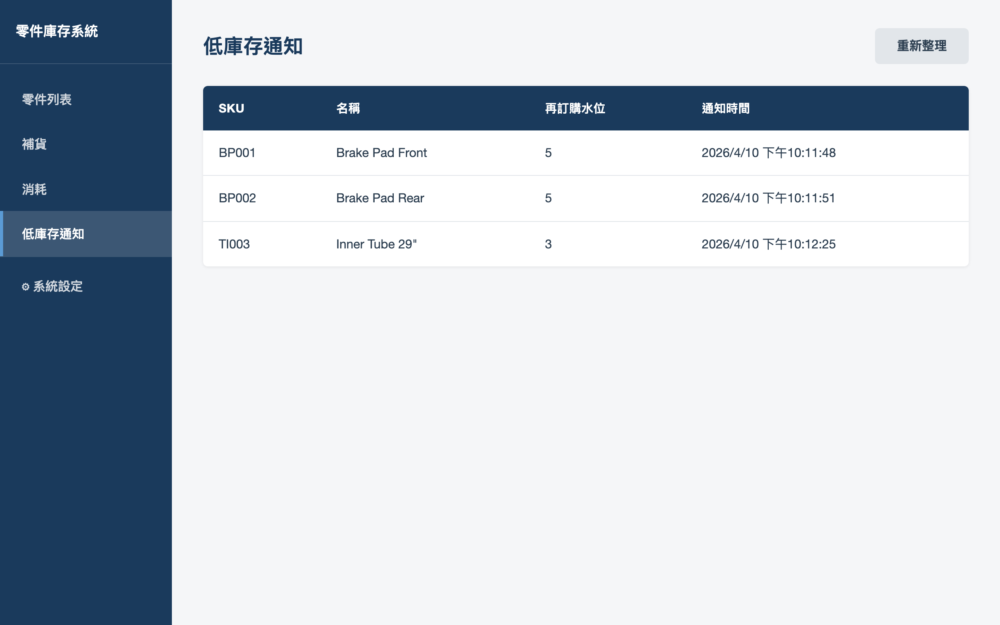
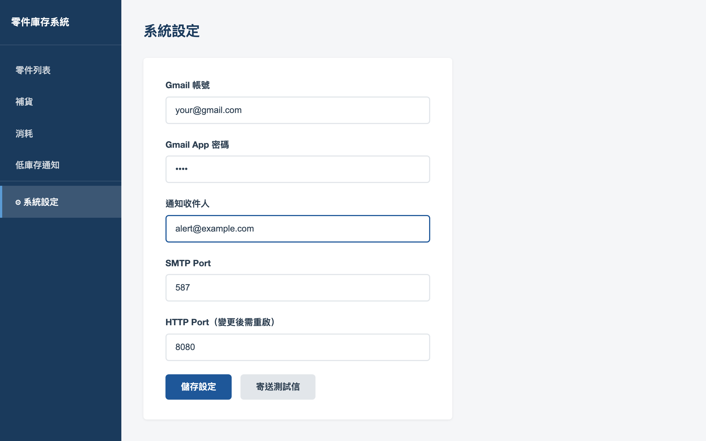
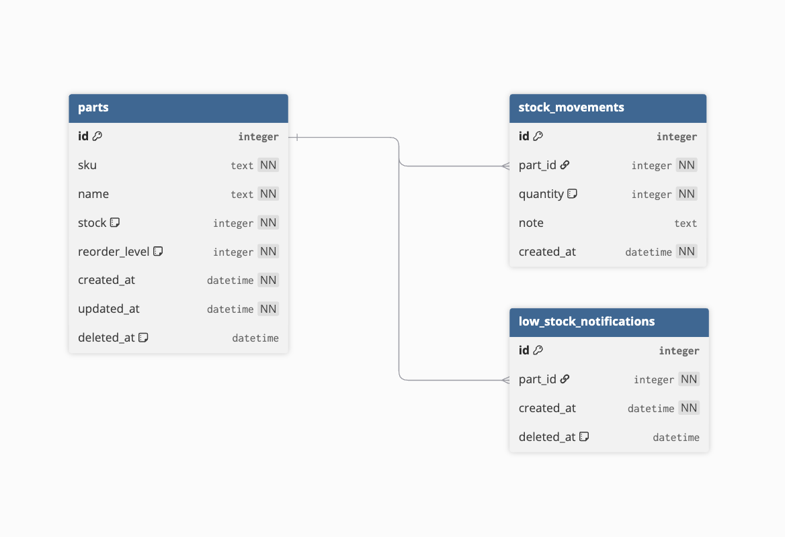

# Bike Parts Inventory

A standalone bicycle parts inventory system for small bike shops and repair studios. The UI is in Traditional Chinese. On first launch, a setup wizard guides you through email notification configuration — no manual config file editing required.

## Screenshots

### Parts List
Parts below their reorder level are highlighted in red.



### Stock In / Out
Log multiple entries at once with optional notes.



### Low Stock Notifications
Shows parts that have triggered an alert. Automatically cleared after restocking.



### Settings
Email settings can be changed directly in the UI with a test-send button. No restart required.



## Features

- Parts CRUD with soft delete
- Stock increase / decrease with movement history
- Low stock email alerts via Gmail SMTP (triggered on decrease + periodic scheduler)
- Idempotency key support for stock mutations
- Vanilla JS frontend (sidebar layout, senior-friendly)
- First-run setup wizard + settings UI (no manual config file editing)
- E2E tests with in-memory SQLite

## Tech Stack

- **Backend**: Go, Gin, SQLite (`go-sqlite3`)
- **Frontend**: Vanilla JS, HTML, CSS (no build step)
- **Email**: Gmail SMTP via `gomail.v2`

## Database Schema



## Setup

```bash
make run
# open http://localhost:8080
```

On first launch, a setup wizard will guide you through email configuration. No `.env` file required.

Optional: copy `.env.example` to `.env` to pre-fill settings via environment variables.

## Data Directory

All persistent data is stored in the OS user config directory:

| OS | Path |
|----|------|
| Windows | `%AppData%\bikeparts\` |

Files created:
- `data.db` — SQLite database
- `config.json` — email and port settings
- `app.log` — rotating log (10 MB max, 3 backups, 30-day retention)

## Make Commands

| Command | Description |
|---------|-------------|
| `make run` | Start the server |
| `make build` | Build binary to `bin/bikeparts` (macOS/Linux) |
| `make build_windows` | Cross-compile `bin/bikeparts.exe` for Windows (requires `mingw-w64`) |
| `make seed` | Seed the local dev DB with sample data (requires `sqlite3` CLI) |
| `make e2e_test` | Run e2e tests |
| `make release` | Tag and push to trigger a GitHub release |

## Environment Variables

Environment variables override settings from `config.json`. Useful for server deployments.

| Key | Description |
|-----|-------------|
| `PORT` | HTTP port (default: `8080`) |
| `DB_PATH` | SQLite file path (default: user config dir) |
| `EMAIL_USER` | Gmail address |
| `EMAIL_PASS` | Gmail app password |
| `EMAIL_TO` | Alert recipient email |
| `SMTP_PORT` | SMTP port (default: `587`) |

## API

### Parts

| Method | Path | Description |
|--------|------|-------------|
| GET | `/api/parts` | List all parts |
| GET | `/api/parts/:id` | Get part by ID |
| POST | `/api/parts` | Create part |
| PUT | `/api/parts/:id` | Update part |
| DELETE | `/api/parts/:id` | Soft delete part |

### Stock

| Method | Path | Description |
|--------|------|-------------|
| POST | `/api/parts/:id/increase` | Increase stock |
| POST | `/api/parts/:id/decrease` | Decrease stock |

### Notifications

| Method | Path | Description |
|--------|------|-------------|
| GET | `/api/notifications` | List active low stock notifications |

### Settings

| Method | Path | Description |
|--------|------|-------------|
| GET | `/api/settings` | Get current settings (password masked) |
| PUT | `/api/settings` | Save settings |
| POST | `/api/settings/test-email` | Send a test email |

> Stock mutation endpoints require an `Idempotency-Key` header (UUID) to prevent duplicate operations.

## Give It a Try (Windows)

Download the latest `bikeparts.exe` from the [Releases page](https://github.com/huimingtw/bikeParts/releases) and run it.
